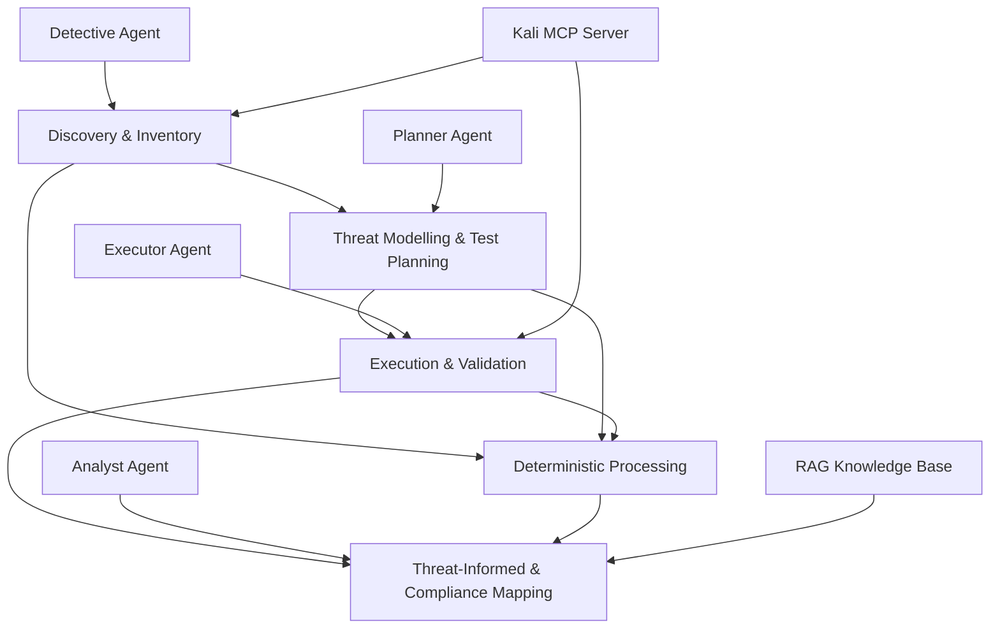

# PTES Multi-Agent Framework for REST API Security Assessment

A research-oriented multi-agent framework for automated **REST API security assessment**, with emphasis on **Shadow API discovery**, **Broken Object Level Authorization (BOLA)**, **Broken Function Level Authorization (BFLA)**, and threat/compliance contextualisation.

The framework is implemented with **CrewAI** and combines LLM-based agents with deterministic security modules, runtime validation, Retrieval-Augmented Generation (RAG), and a Kali Linux MCP server.

The project is designed for **controlled and authorised security-testing environments** and has been evaluated using the OWASP crAPI vulnerable application.

---

## 1. Research Objectives

The framework investigates how LLM-based multi-agent systems can support structured REST API penetration testing while preserving reproducibility, traceability, and deterministic validation.

Its main objectives are to:

* discover documented and undocumented REST API operations;
* identify potential **Shadow APIs** by comparing runtime-observed operations with OpenAPI documentation;
* plan and execute controlled **BOLA** and **BFLA** authorization tests;
* collect reproducible execution evidence;
* validate findings through deterministic post-processing;
* contextualise confirmed findings using:

  * **OWASP API Security Top 10**;
  * **MITRE ATT&CK**, when direct behavioural evidence supports a technique;
  * **NIS2 Article 21** security measures;
* evaluate the framework against independent and frozen ground-truth datasets.

---

## 2. Architecture

The framework follows a layered architecture aligned with the **Penetration Testing Execution Standard (PTES)**.



The architecture deliberately separates **LLM reasoning** from **deterministic evidence processing**.

LLM agents support interpretation, planning, coordination, and contextualisation, while deterministic modules perform operations such as route normalisation, fixture resolution, runtime reconciliation, authorization evidence classification, and evaluation.

---

## 3. Multi-Agent System

### Detective Agent

Responsible for reconnaissance, API discovery, and attack-surface inventory.

Main activities include:

* service and endpoint discovery;
* OpenAPI specification discovery;
* frontend route extraction;
* runtime endpoint validation;
* API inventory construction;
* collection of discovery evidence.

### Planner Agent

Transforms the discovered API surface into structured security-test hypotheses.

Main activities include:

* threat modelling;
* BOLA/BFLA candidate identification;
* test prioritisation;
* definition of baseline and negative actors;
* required fixtures and preconditions;
* expected secure behaviour;
* evidence requirements.

### Executor Agent

Executes controlled authorization tests against the authorised laboratory environment.

The agent uses deterministic execution support to:

* obtain authentication contexts;
* resolve object identifiers and dependencies;
* materialise deterministic fixtures;
* execute comparative authorization tests;
* compare authorised and unauthorised actors;
* record HTTP evidence;
* validate state-changing operations.

### Analyst Agent

Consumes validated evidence and produces the final security interpretation.

Its responsibilities include:

* consolidation of confirmed findings;
* removal of unsupported or inconclusive findings;
* Shadow API reporting;
* OWASP API Security classification;
* MITRE ATT&CK contextualisation when supported by direct evidence;
* NIS2 Article 21 relevance mapping;
* audit-ready reporting.

---

## 4. Deterministic Security Layer

A central design principle of the project is that LLM output alone is **not considered sufficient evidence of a vulnerability**.

Deterministic components are used for:

* OpenAPI parsing;
* route canonicalisation;
* frontend route extraction;
* runtime probe planning;
* active runtime probing;
* Shadow API reconciliation;
* deterministic fixture management;
* authorization baseline comparison;
* evidence classification;
* finding post-processing;
* metric computation.

For Shadow API detection, the framework follows the sequence:

```text
Discovery
    ↓
Runtime observation
    ↓
Canonicalisation
    ↓
OpenAPI reconciliation
    ↓
Documented / Undocumented classification
    ↓
Shadow API validation
```

The OpenAPI specification is therefore used as a **documentation baseline**, not as the sole discovery source.

Runtime discovery and OpenAPI parsing remain methodologically independent until the reconciliation stage.

---

## 5. Shadow API Discovery

Shadow API identification combines multiple evidence sources, including:

* OpenAPI parsing;
* active endpoint discovery;
* frontend JavaScript route extraction;
* runtime probing;
* deterministic route reconciliation.

Observed runtime operations are compared against the documented OpenAPI inventory.

An operation is considered a Shadow API candidate when it is:

1. observed or validated in the running application;
2. identified as an API operation;
3. absent from the corresponding OpenAPI documentation.

Ground truth is **never used during discovery or reconciliation**.

It is introduced only during the final evaluation stage.

---

## 6. Authorization Testing

The framework focuses primarily on:

### BOLA

Broken Object Level Authorization tests compare access to the **same protected object** across different authenticated identities.

Examples of tested object classes include:

* vehicles;
* vehicle locations;
* orders;
* service reports;
* videos;
* posts.

### BFLA

Broken Function Level Authorization tests compare access to **role-sensitive functions** across actors with different privileges.

Examples include:

* administrative functions;
* management endpoints;
* mechanic workflows;
* privileged state-changing operations.

The execution layer records both the authorised baseline and the negative authorization test whenever the application state permits a valid comparison.

---

## 7. Retrieval-Augmented Generation

RAG is used for **methodological and compliance contextualisation**, not for discovering vulnerabilities.

The implementation uses a local **ChromaDB PersistentClient**.

### Retrieval strategy

The framework uses a hybrid retrieval strategy:

```text
Query
  ↓
Deterministic source steering
  ↓
Relevant methodological source
  ↓
Top-k vector similarity
  ↓
Retrieved evidence chunks
  ↓
LLM contextualisation
```

Source steering is performed before vector similarity.

Typical source routing includes:

* OWASP API Security → vulnerability classification;
* MITRE ATT&CK → adversary-behaviour contextualisation;
* NIS2 → regulatory/security-control contextualisation.

Documents are:

1. normalised;
2. divided into chunks;
3. embedded using deterministic local hash embeddings;
4. stored in local ChromaDB;
5. retrieved through top-k similarity search.

The current local embedding implementation uses **384-dimensional deterministic hash embeddings**, avoiding dependency on an external embedding API and improving experiment reproducibility.

RAG does **not** modify ground truth or deterministic evaluation metrics.

---

## 8. Kali MCP Server

Security-tool execution is provided through the external:

**DurkDiggler/Kali-MCP-Server**

GitHub:

https://github.com/DurkDiggler/Kali-MCP-Server

The server exposes Kali Linux security tooling through both **Model Context Protocol (MCP)** and an HTTP interface.

In the current laboratory architecture, the framework communicates with the server through its HTTP execution endpoint:

```text
http://127.0.0.1:5000/run
```

### Install the Kali MCP Server

Clone the external repository:

```bash
git clone https://github.com/DurkDiggler/Kali-MCP-Server.git
cd Kali-MCP-Server
```

Start the server using Docker Compose:

```bash
docker compose up -d
```

Verify that the service is running:

```bash
curl http://127.0.0.1:5000/health
```

The framework's `KaliMCPTool` acts as the interface between CrewAI agents and the Kali MCP server.

Typical reconnaissance capabilities used by the framework include tools such as:

* Nmap;
* Gobuster;
* Dirb;
* Nikto;

with additional tools available according to the MCP server configuration and whitelist.

When the target laboratory and Kali MCP server run in separate Docker environments, both must be placed on mutually reachable Docker networks.

Example:

```bash
docker network connect <crapi_network> kali-mcp-server
```

Do not expose the Kali MCP HTTP interface directly to untrusted networks.

---

## 9. Experimental Environment

The framework has been developed and evaluated using **OWASP crAPI** as the controlled vulnerable REST API environment.

A typical laboratory contains:

```text
Host System
│
├── CrewAI Multi-Agent Framework
│
├── Local ChromaDB
│
├── Kali MCP Server
│      └── Security tools
│
└── Docker Network
       └── OWASP crAPI
```

The target URL used by the execution layer can be configured through:

```env
EXECUTION_TARGET_URL=http://crapi-web
```

The environment must only point to systems for which explicit authorization to perform security testing exists.

---

## 10. Installation

### Requirements

* Python >= 3.10 and < 3.14
* Git
* Docker
* Docker Compose
* CrewAI
* UV
* OWASP crAPI laboratory
* Kali MCP Server

Clone this repository:

```bash
git clone https://github.com/KianuVela/ptes-multi-agents-framework.git
cd ptes-multi-agents-framework
```

Install UV if necessary:

```bash
pip install uv
```

Install project dependencies:

```bash
crewai install
```

Create or configure the `.env` file:

```env
OPENAI_API_KEY=<your-api-key>
EXECUTION_TARGET_URL=http://crapi-web
```

Never commit API keys, credentials, authentication tokens, or other secrets to the repository.

---

## 11. Running the Framework

Before starting the CrewAI workflow:

1. start the OWASP crAPI laboratory;
2. start the Kali MCP server;
3. verify network connectivity between the components;
4. configure the required environment variables.

Then run:

```bash
crewai run
```

The workflow coordinates discovery, planning, execution, deterministic validation, analysis, and reporting.

---

## 12. Project Structure

```text
ptes-multi-agents-framework/
│
├── src/
│   └── red_team_agents/
│       ├── config/
│       │   ├── agents.yaml
│       │   └── tasks.yaml
│       │
│       ├── core/
│       │   └── execution/
│       │
│       ├── deterministic_shadow_api/
│       ├── evaluation/
│       ├── post_processing/
│       ├── rag/
│       ├── tools/
│       ├── crew.py
│       └── main.py
│
├── tests/
│   └── ground_truth/
│
├── outputs/
├── reports/
│   ├── ground_truth/
│   ├── rag/
│   └── shadow_api/
│
├── .env
├── pyproject.toml
└── README.md
```

---

## 13. Main Research Artefacts

Important generated artefacts include:

```text
outputs/execution/authentication_context.json
outputs/execution/object_context.json
outputs/execution/authorization_evidence_summary.json

outputs/analysis/validated_analyst_findings.json

outputs/compliance/compliance_mapping_draft.json
outputs/compliance/validated_compliance_mapping.json

reports/shadow_api/
reports/rag/
reports/ground_truth/
```

These artefacts provide traceability between:

```text
Discovery
→ Planning
→ Execution
→ Evidence
→ Validation
→ Finding
→ Compliance/Threat Mapping
→ Evaluation
```

---

## 14. Ground Truth and Evaluation

Evaluation is deliberately separated from framework execution.

Ground-truth datasets are frozen before evaluation and are not available to agents during discovery, planning, or execution.

The evaluation baseline contains:

* documented API operations derived independently from the crAPI OpenAPI specification;
* independently identified Shadow APIs;
* selected official crAPI BOLA/BFLA challenge cases;
* expected OWASP/NIS2/MITRE mapping information where applicable.

Evaluation metrics include:

* Endpoint Coverage;
* Shadow API Precision;
* Shadow API Recall;
* Shadow API F1-score;
* BOLA/BFLA Precision;
* BOLA/BFLA Recall;
* BOLA/BFLA F1-score;
* Mapping Precision;
* Mapping Recall;
* Artefact Completeness;
* Assessment Time.

This separation prevents ground-truth information from leaking into framework discovery or vulnerability classification.

---

## 15. Methodological Principles

The framework follows several methodological constraints:

* LLM reasoning does not replace deterministic validation.
* Ground truth is used only for evaluation.
* Runtime discovery is independent of OpenAPI parsing.
* Raw execution evidence is preserved.
* Canonicalisation occurs only in deterministic processing.
* Exact route matches are evaluated before template matches.
* HTTP success alone does not automatically prove a vulnerability.
* Inconclusive evidence remains inconclusive.
* MITRE ATT&CK mappings require direct behavioural evidence.
* RAG provides contextual knowledge but does not alter experimental ground truth or metrics.

---

## 16. Research Scope

The current prototype concentrates on:

* REST APIs;
* Shadow API discovery;
* BOLA;
* BFLA;
* automated multi-agent penetration-testing workflows;
* deterministic evidence validation;
* threat-informed interpretation;
* NIS2-aware security assessment.

The framework is a research prototype and is **not intended to replace professional penetration-testing judgement or formal compliance auditing**.

---

## 17. Responsible Use

This project is intended exclusively for:

* academic research;
* authorised penetration testing;
* controlled cyber ranges;
* intentionally vulnerable applications such as OWASP crAPI;
* defensive security experimentation.

Do not use the framework against systems without explicit permission.

The Kali MCP server provides access to powerful security tools and should remain isolated from untrusted networks.

---

## 18. Technologies

Core technologies used by the project include:

* Python
* CrewAI
* Docker
* OWASP crAPI
* Kali Linux
* Model Context Protocol
* ChromaDB
* OpenAPI
---

## 19. Acknowledgements

This project builds upon open-source technologies and security resources provided by:

* CrewAI;
* OWASP and the crAPI project;
* MITRE ATT&CK;
* the European Union NIS2 framework;
* ChromaDB;
* DurkDiggler/Kali-MCP-Server;
* the broader open-source security research community.

---

## 20. Disclaimer

This repository contains an experimental research framework for automated security assessment.

Results produced by autonomous or semi-autonomous agents must be independently reviewed before being interpreted as confirmed security vulnerabilities or compliance conclusions.
